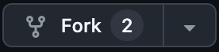
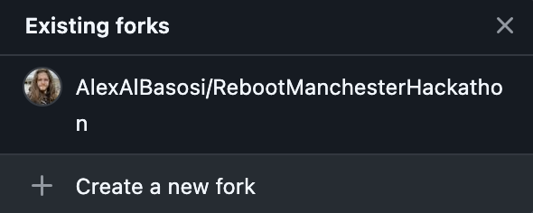
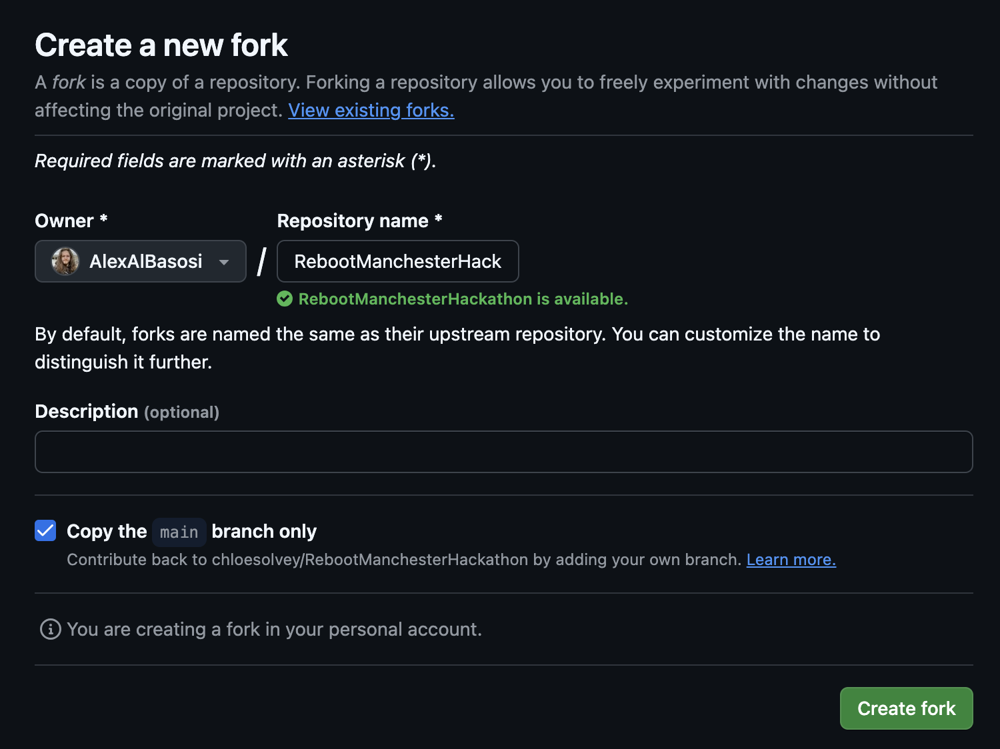
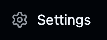
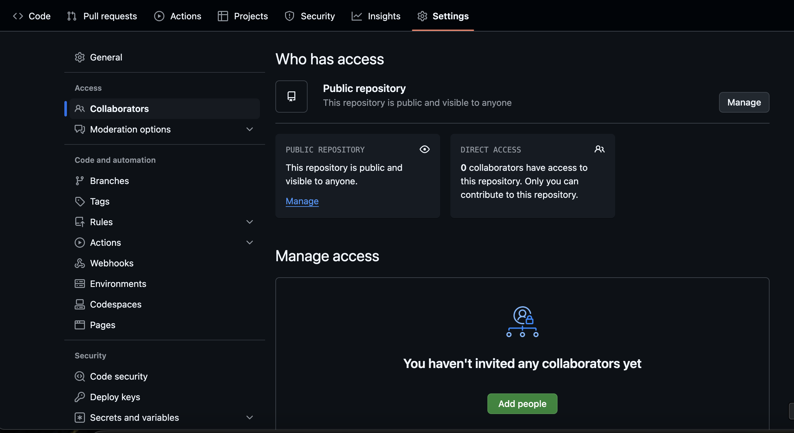
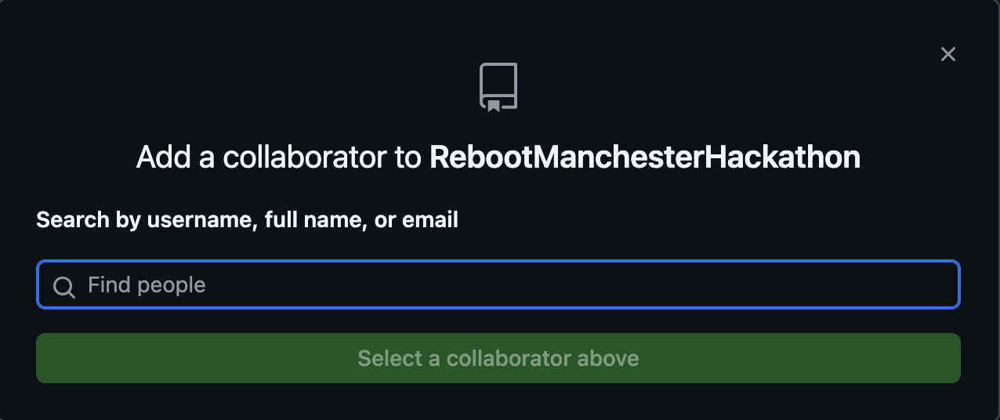

# Reboot Manchester Hackathon

This is the repository for the Reboot Hackathon being held in Manchester.

## Fork this Repository

To track each team's code repositories, any team member who's responsible for building a component must fork this repository so that it can be incorporated into the judging criteria when selecting the winners.

To fork this repository, select the `Fork` dropdown menu next to the title:

Then select `+ Create New Fork`:

For the `Repository name`, please make sure you enter your team's name so that we can keep track of the different repositories.

If your team is building multiple components and requires multiple repositories, fork this repository and enter the team name followed by the name of the component.

For example, if you have a `frontend` and `backend` application, the first fork can be called `TeamName-frontend` and the second fork can be called `TeamName-backend`.

> [!NOTE]
> If you're only building a single component, you can leave the `Repository name` as `TeamName`.

Once you've entered the name, select `Create fork`:

## Add Collaborators

Now that you've created your own fork, if another member within your team wants to contribute to the code, you would need to add them as a collaborator.

To do so, navigate to the repository containing your fork and click on `Settings`:

Then select the `Collaborators` option in the navigation menu on the left:

Select `Add people`:

And search for the `username`, `full name`, or `email` of the member you want to add to the repository.

Then they can clone your repository and contribute code to your fork.

> [!NOTE]
> Please make sure to add them to your forked version of the repository. You won't be able to add them here directly.

Now you're ready to start. Happy coding!
